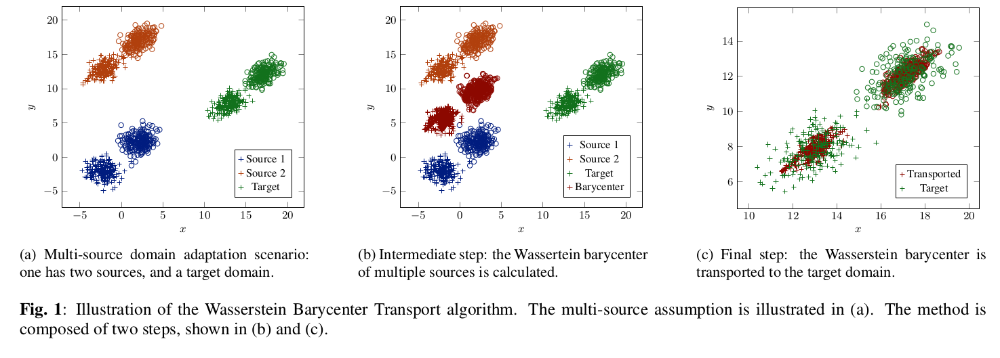

# Wasserstein Barycenter Transport for Acoustic Adaptation

This repository contains the implementation of the so-called Wasserstein Barycenter Transport Algorithm, explored in the following publications,

Eduardo F. Montesuma, Fred-Maurice Ngolè Mboula, "Wasserstein Barycenter Transport for Domain Adaptation", International
Conference on Acoustics, Speech, and Signal Processing (ICASSP) 2021.

Eduardo F. Montesuma, Fred-Maurice Ngolè Mboula (2021, June). Wasserstein Barycenter Transport for Multi-Source Domain Adaptation. In 2021 IEEE conference on computer vision and pattern recognition (to appear)

# News

* 27/05/2021: GPU implementation for the Wasserstein Barycenter Transport/Sinkhorn algorithm is now available using torch. This implementation is preferred as it speeds up computation.
* 13/05/2021: ICASSP publication is on IEEE Explore. Access is free for a month.

# Intuition


# Modules

In this repo we provide a single package that implements all tested domain adaptation algorithms. Especially, TCA and KMM were implemented using the [libtlda](https://github.com/wmkouw/libTLDA) toolbox and OT-related methods were implemented through the [POT](https://pythonot.github.io/) toolbox. The implementations can be found in the ./msda folder.

# Data

You can either use pre-extracted featuers (available on ./data folder) or download the samples and run the generation
scripts provided in this repo.

## Music-Speech Discrimination
1. Music Speech Recognition [Source](http://marsyas.info/downloads/datasets.html) [Direct Link](opihi.cs.uvic.ca/sound/music_speech.tar.gz)
2. Noise Dataset [Source](http://spib.linse.ufsc.br/noise.html)

## Music Genre Recognition
1. GTZAN Music Genre Recognition [Source](http://marsyas.info/downloads/datasets.html) [Direct Link](opihi.cs.uvic.ca/sound/genres.tar.gz)
2. Noise Dataset [Source](http://spib.linse.ufsc.br/noise.html)

## Face Recognition
1. Caltech-Office Decaf features [Source](https://github.com/jindongwang/transferlearning/blob/master/data/dataset.md) [Direct Link](https://mega.nz/folder/QDxBBC4J#LizxWbE1_JEwPSrA2mrrrw)

## Object Recognition
1. PIE Dataset [Source](https://github.com/jindongwang/transferlearning/blob/master/data/dataset.md#pie)

__NOTE:__ on the ICASSP publication we explore solely Music-Speech Discrimination and Music-Genre Recognition. In the CVPR publication, we explore all four.

# Results

## Results for Music Genre Recognition (MGR)

| Method       | Buccaneer2                       | Destroyerengine                    | F16                                | Factory2                           |
|--------------|----------------------------------|------------------------------------|------------------------------------|------------------------------------|
| Baseline     | 22.90 ± 0.84                 | 38.25 ± 0.91                   | 51.57 ± 1.11                   | 47.80 ± 0.34                   |
| KMM          | 21.75 ± 0.99                 | 39.25 ± 0.66                   | 49.81 ± 1.69                   | 47.37 ± 0.71                   |
| TCA          | <ins>58.95 ± 1.27</ins>     | 60.67 ± 2.07                   | <ins>68.75 ± 2.11</ins>       | 59.82 ± 0.50                   |
| SinT         | 56.35 ± 0.84                 | <ins>61.92 ± 1.64</ins>       | 66.72 ± 1.86                   | 61.77 ± 1.65                   |
| SinT<sub>reg</sub> | 58.02 ± 1.45                 | 60.47 ± 1.75                   | 66.55 ± 1.60                   | <ins>63.87 ± 1.51</ins>       |
| JCPOT        | 35.87 ± 0.41                 | 48.47 ± 2.97                   | 51.92 ± 3.25                   | 51.95 ± 1.75                   |
| JCPOT-LP     | 36.40 ± 0.39                 | 52.92 ± 1.32                   | 56.30 ± 0.37                   | 51.52 ± 2.28                   |
| WBT          | 21.37 ± 2.25                 | 24.30 ± 2.71                   | 25.30 ± 6.02                   | 22.70 ± 2.25                   |
| WBT<sub>reg</sub>  | **70.60** ± **1.33** | **83.10** ± **1.64** | **83.92** ± **1.01** | **90.00** ± **0.86** |
| Target-only  | 67.43 ± 1.43                 | 67.96 ± 2.91                   | 66.86 ± 2.00                   | 68.37 ± 1.87                   |

## Results for Music-Speech Discrimination (MSD)

| Method       | Buccaneer2                         | Destroyerengine                    | F16                              | Factory2                           |
|--------------|------------------------------------|------------------------------------|----------------------------------|------------------------------------|
| Baseline     | 82.43 ± 1.75                   | 51.57 ± 2.56                   | 88.89 ± 2.72                 | 50.02 ± 2.21                   |
| KMM          | 87.12 ± 2.79                   | 52.35 ± 2.94                   | 74.86 ± 5.58                 | 50.41 ± 2.17                   |
| TCA          | 90.43 ± 1.40                   | 87.14 ± 4.99                   | **95.12** ± **2.02** | 84.76 ± 3.30                   |
| SinT         | 89.26 ± 1.56                   | 82.84 ± 2.78                   | 84.97 ± 3.09                 | <ins>91.21 ± 2.04</ins>       |
| SinT<sub>reg</sub> | 87.28 ± 2.97                   | 84.38 ± 1.76                   | 86.14 ± 2.79                 | 90.61 ± 1.68                   |
| JCPOT        | <ins>92.55 ± 2.11</ins>       | <ins>87.89 ± 1.39</ins>       | 88.67 ± 1.67                 | 82.41 ± 2.22                   |
| JCPOT-LP     | 89.06 ± 1.38                   | 84.97 ± 3.23                   | 90.24 ± 1.71                 | 86.13 ± 1.88                   |
| WBT          | 56.88 ± 9.54                   | 56.63 ± 6.88                   | 56.63 ± 6.56                 | 59.38 ± 2.61                   |
| WBT<sub>reg</sub>  | **96.42** ± **1.48** | **92.79** ± **2.95** | <ins>93.75 ± 0.97</ins>     | **95.31** ± **1.11** |
| Target-only  | 90.51 ± 3.98                   | 93.07 ± 3.81                   | 89.23 ± 4.25                 | 92.30 ± 3.62                   |

# Citation

If you find this work useful in your research, please consider citing us using the bibtex below,

```
@INPROCEEDINGS{montesuma2021,
  author={Montesuma, Eduardo F. and Ngolè Mboula, Fred-Maurice},
  booktitle={ICASSP 2021 - 2021 IEEE International Conference on Acoustics, Speech and Signal Processing (ICASSP)}, 
  title={Wasserstein Barycenter Transport for Acoustic Adaptation}, 
  year={2021},
  volume={},
  number={},
  pages={3405-3409},
  doi={10.1109/ICASSP39728.2021.9414199}}
```
